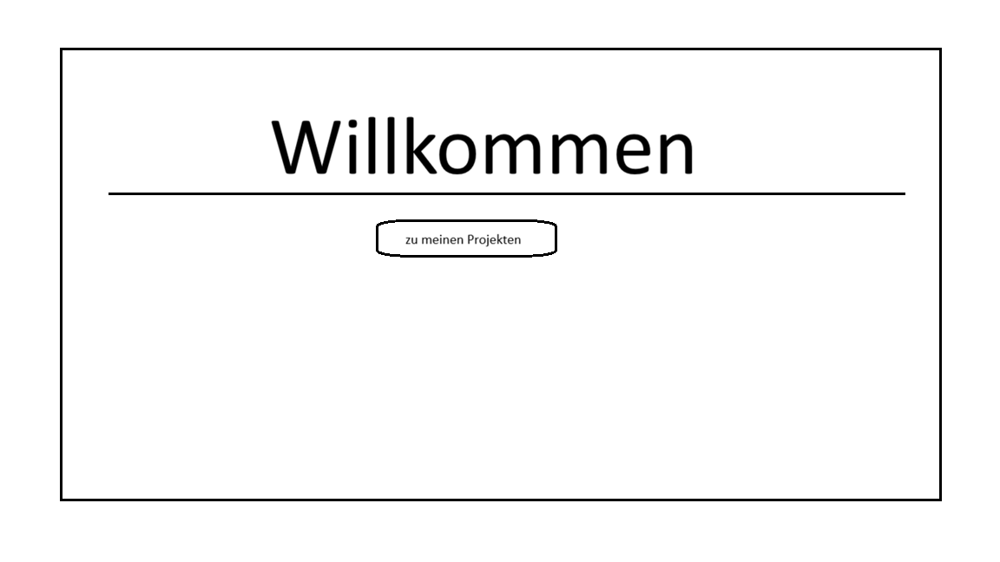
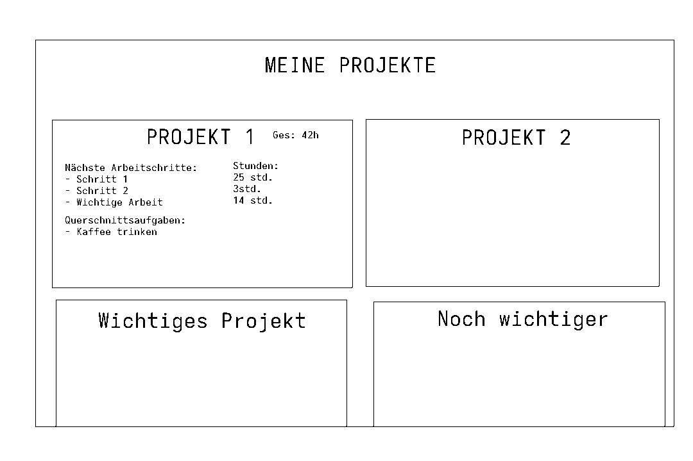
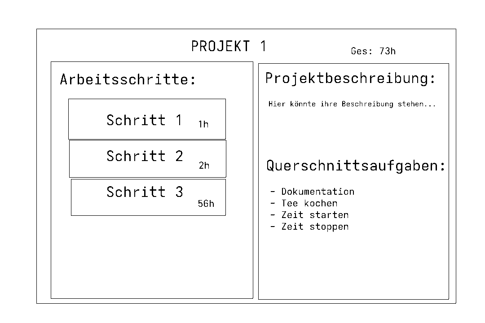
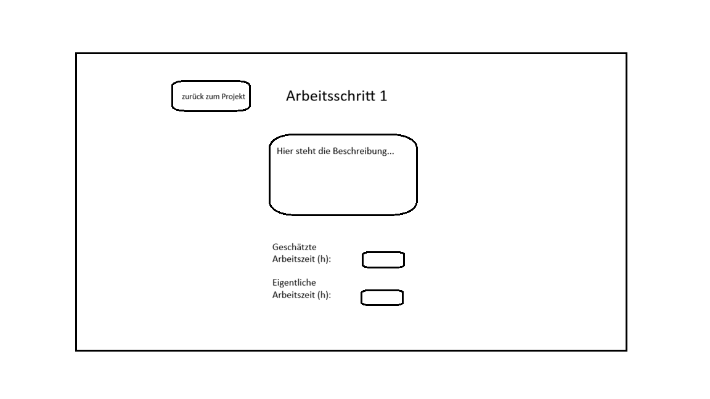
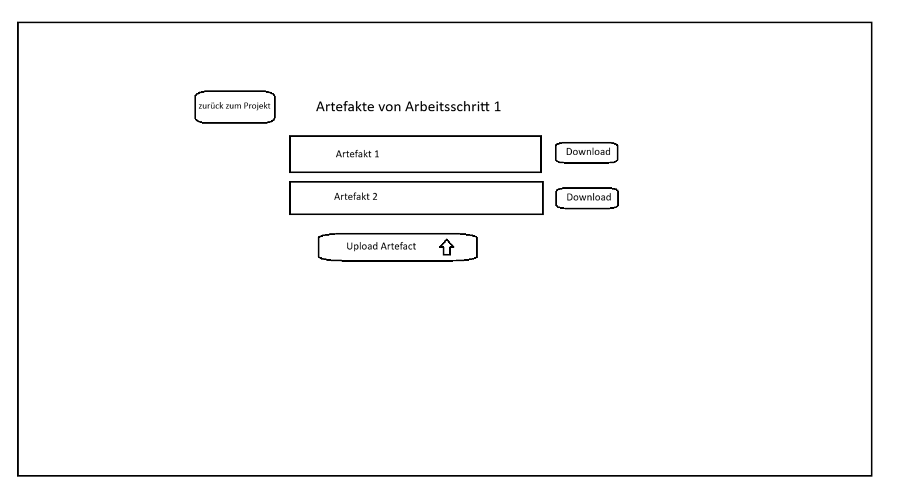
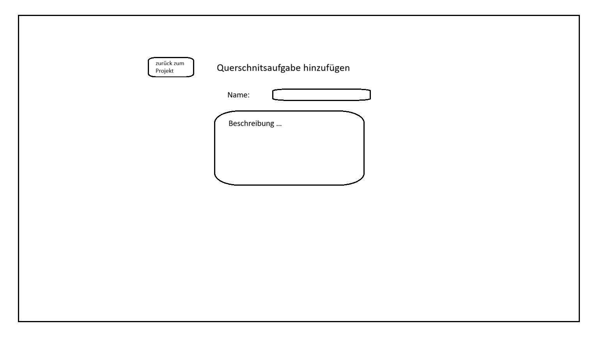

# 1. Userstories
| Titel | Als... | möchte ich... | damit... |  Story Points |
|-------|--------|---------------|----------| ------------|
| Startseite | Benutzer | eine Startseite haben | ich ein schönes Willkommen habe | 2 |
| Projektübersicht | Benutzer | eine Projektübersichtsseite | ich ein einen Überblick über alle meine Projekte habe | 4 |
| Projektseite | Benutzer | eine Projektseite | ich einen Überblick über ein einzelnes Projekt und alle Arbeitsaufgaben darin habe | 5 |
| Projekt anlegen | Benutzer | ein Projekt anlegen können | ich ein neues Projekt mit meinen eigenen Daten anlegen kann | 4 |
| Arbeitsschrittseite | Benutzer | Einen detailierten Überblick über einen Arbeitsschritt haben und dessen Artefakte einsehen können | ich einen den Arbeitsschritt möglichst gut bearbeiten kann und einen vollständiges Verständnis dafür erlangen kann | 5 |
| Arbeitsschritte anlegen | Benutzer | Arbeistsschritte anlegen können und meine Artefakte hochladen könne | ich Arbeitsschritte möglichst genau und verständlich beschreiben kann | 5 |
| Benötigte Arbeitszeitschätzung | Benutzer | Für einen Arbeitsschritt die benötigte Zeit abschätzen können und eintragen | ich diese für mein gesamtes Projekt sammeln kann und mit der gesamten Arbeitszeit besser planen kann | 2 |
| Tatsächliche Arbeitsstunden | Benutzer | Die tatsächlichen Arbeitsstunden für einen Arbeitsschritt eintragen können | ich meine tatsächliche Arbeitszeit mit der geschätzen Arbeitszeit vergleichen, um in Zukunft besser planen zu können | 2 |
| Querschnittsaufgaben | Benutzer | Querschnittsaufgaben anlegen können, die für alle Arbeitsschritte in meinem Projekt eine Aufgabe hinzufügen | ich standardaufgaben für ein Projekt nur einmal für das Projekt definieren muss und der User bei jedem Arbeitsschritt erneut daran erinnert wird. | 1 |
| 

# 2. Mockups - Purple TransPlannner PPTP 

# 3. Aufwandsschätzung

## Strategie

Wir verteilen Story-Points um die Verhältnisse des Arbeitsaufwandes zwischen den User-Stories Abschätzen zu können. Auf Basis dieser Abschätzung legen wir eine Arbeitszeit pro Story-Point fest. Somit lässt sich der Gesammtaufwand schätzen.

## Kennzahlen
- Story Points
- Arbeitsstunden

## Zahl in Mann-Frau Stunden

30 Story Points insgesammt
4 Arbeitsstunden
-> 120 Mann-Frau Stunden insgesammt